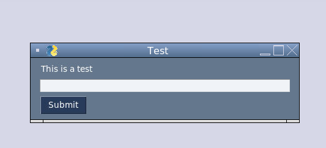
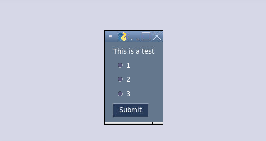
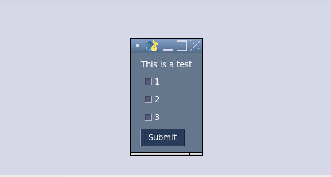
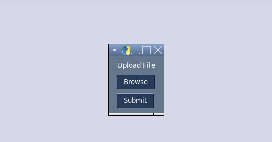
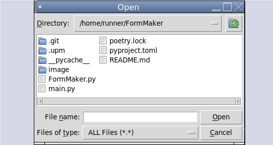
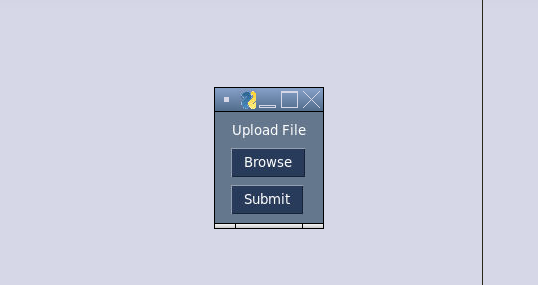
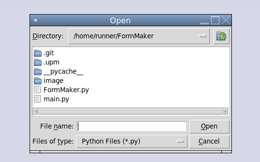
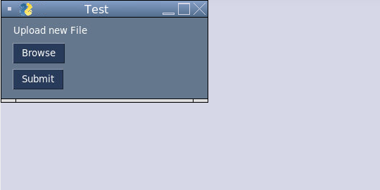
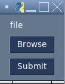

# FormMaker
A form maker built with PySimpleGUI
Version 1.1
# New Changes
- Vfej
Version 1.0

# READ THIS BEFORE CONTINUING
This only works with Python 3+, This is due to PySimpleGUI requiring it.
# A quick note
If you want to see a demo of the program you can call FormMaker.demo() to see a demo form with all elements  
Also the way the code is structred when you have more than one multichoice or select all that apply, Duplicate layout messages may appear in the terminal, This is normal. When you recive your response from the form it sometimes looks like this:
```python
'This is a testx': False
```
Also you can copy and paste form the examples folder to get started
# Commands
### create()
Clears any existing forms and creates a new one or just creates a new form
### add()
add is a object, add any other commands execpt display to add to the form
#### shortans(prompt)
shortans is a Short answer object- adds a short answer object to the form  
prompt is to be str or int, when making use the appropriate command to convert str->int or int->str  
Example:
```python
 import FormMaker as fm
 form.create("Short answer")
 fm = form.add()
 fm.shortans("hi")
 form.display()
```
Output:  
  
Terminal:  
```python
{'This is a test': 'hi'}
```
#### multichoice(prompt,options)
multichoice is a multiple choice answer object- adds a multiple choice answer object to the form  
prompt is to be str or int, when making use the appropriate command to convert str->int or int->str  
options is to be list, when making use the appropriate command to convert str->int or int->str when adding to the options list  
options format should look like this  
```python
(("Python Files","*.py"))
```
Example:
```python
 import FormMaker as fm
 form.create("Multi-Choice")
 fm = form.add()
 fm.mutichoice("Multiple Choice",['1','2','3'])
 form.display()
```
Output  
  
Terminal:  
```python
{'This is a test': True, 'This is a test0': False, 'This is a test1': False}
```
#### select_ata(prompt,options)
select_ata is a select all that apply object- adds a select all that apply object to the form  
prompt is to be str or int, when making use the appropriate command to convert str->int or int->str  
options is to be list, when making use the appropriate command to convert str->int or int->str when adding to the options list (if needed)  
Example:
```python
 import FormMaker as fm
 form.create("Select all that apply")
 fm = form.add()
 fm.select_ata("Select all that apply",['1','2','3'])
 form.display()
```
Output  
  
Terminal:  
```python
{'This is a test': True, 'This is a test0': True, 'This is a test1': False}
```
#### uploadfile(prompt)
uploadfile is a file upload object- adds a select all that apply object to the form  
prompt is to be str or int, when making use, use the appropriate command to convert str->int or int->str  
Example:
```python
 import FormMaker as fm
 form.create("Select all that apply")
 fm = form.add()
 fm.uploadfile("Upload File")
 form.display()
```
Output
  
   
Terminal:  
```python
{'Browse': '/home/runner/FormMaker/main.py'}
```
#### uploadfile_rt(prompt,file types)
uploadfile_rt is a file upload object that allows only a certain type of file- adds a select all that apply object to the form  
prompt is to be str or int, when making use the appropriate command to convert str->int or int->str  
Example:
```python
 import FormMaker as fm
 form.create("Select all that apply")
 fm = form.add()
 fm.uploadfile_rt("Upload File",(('Python Files', '.py')))
 form.display()
```
Output:  
  
   
Terminal:  
```python
{'Browse': '/home/runner/FormMaker/main.py'}
```
#### image(prompt,filename)
image is an image object- it adds an image to form  
prompt is to be str or int, when making use, use the appropriate command to convert str->int or int->str  
Example:
```python
 import FormMaker as fm
 form.create("Select all that apply")
 fm = form.add()
 fm.uploadfile_rt("Upload File",(('Python Files', '.py')))
 form.display()
```
Output:  
  
   
Terminal:  
```python
{'Browse': '/home/runner/FormMaker/main.py'}
```
#### dropdown(prompt,option)
dropdown object is an that allows only a certain type of file- adds a select all that apply object to the form  
prompt is to be str or int, when making use the appropriate command to convert str->int or int->str  
Example:
```python
 import FormMaker as fm
 form.create("Select all that apply")
 fm = form.add()
 fm.uploadfile_rt("Upload File",(('Python Files', '.py')))
 form.display()
```
Output:  
  
   
Terminal:  
```python
{'Browse': '/home/runner/FormMaker/main.py'}
```
#### create_fromurl(url)
create_fromurl object allows you to create a form from an html form object, 
url (str)- can be an https:// or http://
Example:
```python
 import FormMaker as fm

 fm.create("Test")
 form = fm.networkform
 form.create_fromurl('https://quicknetworkfilesystem.sethedwards.repl.co/pathadd/Share/f.txt')
```
Output:

##### Supported html elemnts
input
file
checkbox
##### Returns
Form Data- Form submission data
Request Failed-Form grabbing failed
#### fill_formurl(url)
fill_fromurl allows you create and fill a form from a website
url (str)-can be an https:// or http://
NOTE: Prompt Text will html header name.
Example:
```python
 import FormMaker as fm

 fm.create("Test")
 form = fm.networkform
 form.fill_fromurl('https://quicknetworkfilesystem.sethedwards.repl.co/pathadd/Share/f.txt')
```
Output:
  
Returns: 
Sent-Form sent
Sending Failed-Form submission failed
Request Failed-Form grabbing failed

##### Supported html elements
input
file
# The End
Well you made it to the end of the documentation.

# Plans for the future
- Add Image Support  
- Add multi-file uploading
- Save form templates
# Thanks!
©2021 Seth Edwards

